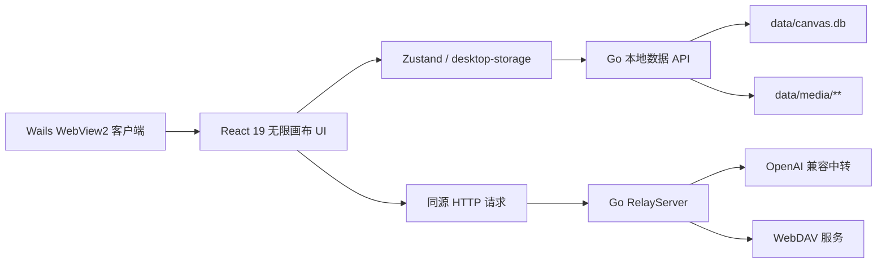

# 架构说明

## 总体结构



## 客户端宿主

- `main.go` 嵌入 `frontend/dist`，创建 1440×900 的 Wails 窗口，最小尺寸 1024×680。
- `app.go` 管理数据层和窗口生命周期；启动时创建数据目录与 SQLite，关闭时释放数据库连接。
- `relay.go` 同时作为 Wails AssetServer 中间件和开发模式环回 HTTP 服务，并提供本地状态/媒体 API。
- 生产模式下 `/canvas/home`、`/canvas/workspace`、`/canvas-repair` 安全回退到 SPA 入口，直接跳转或刷新不会产生 404。

## 运行时数据层

默认数据根目录由 `filepath.Dir(os.Executable())/data` 确定，可用 `INFINITE_CANVAS_DATA_DIR` 覆盖：

```text
程序目录/
├─ BoundlessStudio.exe
└─ data/
   ├─ canvas.db
   └─ media/
      ├─ images/
      ├─ videos/
      ├─ audio/
      └─ files/
```

SQLite 使用 `modernc.org/sqlite`，启用 WAL 与 busy timeout，包含：

- `app_state`：对话、画布、节点元数据、设置、模型路由、认证、生成日志、视图偏好等 JSON 状态。
- `media_files`：媒体 storage key、相对路径、MIME、字节数、创建/访问时间、保留状态与分类索引。

媒体写入先落临时文件再原子重命名，避免异常退出留下半文件；读取支持 HEAD 与 HTTP Range，适配视频播放。相对路径经过目录边界检查，媒体删除同时更新文件与索引。

本地接口：

| 路径 | 方法 | 用途 |
|---|---|---|
| `/client-api/state?key=...` | GET/PUT/DELETE | SQLite 状态读写 |
| `/client-api/media?key=...` | GET/HEAD/POST/PUT/PATCH/DELETE | 媒体上传、读取、覆盖、元数据更新与删除 |
| `/client-api/media-index` | GET | 媒体索引 |
| `/client-api/canvas-data` | DELETE | 清理画布状态和媒体，保留桌面中转配置 |

## 前端存储适配

- `src/services/desktop-storage.ts` 封装 SQLite 状态、本地媒体 API 和旧数据迁移。
- `localforage-storage.ts`、`image-storage.ts`、`file-storage.ts` 先访问 Go 本地存储；旧 localStorage/IndexedDB/localforage 仅作为迁移来源。
- 迁移成功后删除旧副本；独立 Vite 开发且 Go API 不在线时才临时回退浏览器存储。
- 旧 `%AppData%\InfiniteCanvas\config.json` 在 Go 启动时一次性迁移到 `app_state` 的 `desktop:client_config`。
- 极小的用户 scope 缓存仍同步保留在 localStorage，用于 SQLite 异步 hydration 前确定作用域；真实对话、画布、设置和认证对象均存入 SQLite。

## 前端重构边界

- Next.js 宿主能力由 `src/compat/next-navigation.ts`、`next-link.tsx`、`next-image.tsx` 提供等价 React/Vite 行为。
- TypeScript 和 Vite 均把 `next/*` 映射到兼容层；`package.json` 不包含 Next.js 运行时依赖。
- 原布局、字体、Ant Design Reset 与画布 CSS 保持一致；13 个 Inter / JetBrains Mono WOFF2 文件已进行 SHA-256 对比。
- 所有需求适配文件都在 `frontend/scripts/compare-source.mjs` 中记录原因；其余 76 个画布文件逐字节一致，缺失 0、内容差异 0。

## API 中继

- 设置界面提供“中转设置 / 模型路由设置 / 软件更新”三个顶部页签，没有平台通道和本地号池选项。
- `/local-relay-proxy/*` 根据请求头选择用户配置的 OpenAI 兼容中转，支持流式响应。
- `/webdav-proxy` 保留 WebDAV 全方法代理。
- Go 端保留原平台路径的兼容代理路由，用于兼容旧调用，但不作为客户端 UI 可选运行模式。
- 代理控制头在转发前删除；自定义中转地址仅允许 `http`/`https`。

## 生命周期

1. Wails 启动并解析可执行文件目录。
2. 创建 `data` 与四类媒体子目录，打开/迁移 `canvas.db`。
3. WebView 加载 React 应用，前端从 SQLite hydration，并按需迁移旧浏览器数据。
4. 媒体通过本地 API 写入 `data/media/**`，业务状态写入 SQLite。
5. 正常关闭窗口时 `OnShutdown` 关闭数据库连接。
